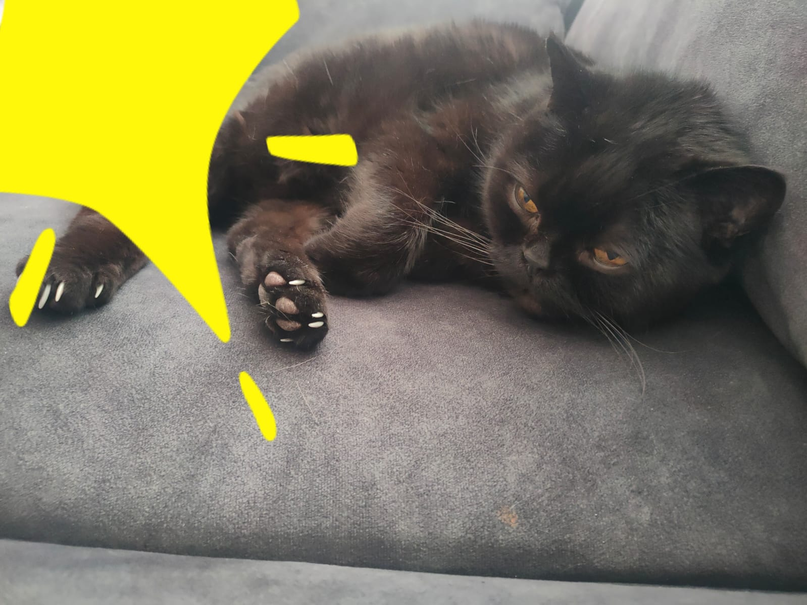

Hi, im a chemistry master student  

    

I have a bachelor's degree in chemistry from the Shulich Faculty of Chemistry at the Technion. 

I love my cat Chernesh, and I enjoy playing the [trombone](https://en.wikipedia.org/wiki/Trombone)

About the [Python Course](/course.md)  
My courses' [Assignments Repository](https://github.com/LevyShaked/Assignments_rep) 

At the request of the audience, here is an additional photo of Chernesh, 
struggled with his instincts

  

      

Say meowelloo to Chernesh   

